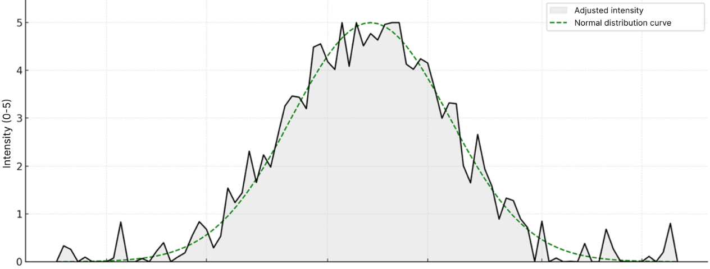

# 🌿 Allergy Tracker Intensity Predictor

This repository contains the backend prediction service for the **Allergy Tracker** app. It provides daily allergy intensity forecasts based on environmental data using a trained machine learning model.

---

## 🧠 Model Overview

The prediction system uses a **Random Forest Regressor** trained on weather deviation data to estimate how real-time environmental factors affect pollen intensity. 

It starts by generating a **baseline intensity curve** using a **normal distribution**, assuming that the plant’s pollen production peaks mid-season and decreases toward the start and end of the blooming period. This curve models natural blooming patterns in ideal weather conditions.

The model then adjusts this baseline using real-time weather data (temperature deviation, humidity, wind speed, and cloud cover) to provide a refined, realistic daily forecast.



*Gray area – final adjusted intensity | Green dashed – baseline normal distribution*


### 🔍 Input Features

The model takes daily environmental averages as input:
```json
{
  "Temperature_Deviation_C": "...",
  "Humidity_Percent": "...",
  "Wind_Speed_kmh": "...",
  "Cloud_Cover_Percent": "..."
}
````

### 📈 Output

A list and dictionary of daily allergy intensity values, from 0 to 5.

---

## 🔗 API Endpoints

### `POST /predict`

**Request Body:**

```json
{
  "start_date": "01/08/2024",
  "end_date": "15/08/2024",
  "latitude": 50.45,
  "longitude": 30.52,
  "timezone": "Africa/Cairo"
}
```

**Response:**

```json
{
  "updated_array": [ ... ],
  "updated_dict": {
    "YYYY-MM-DD": intensity
  }
}
```

### `GET /ping`

A lightweight health check endpoint used to keep the server instance on platforms like Render.com alive via uptime pings (e.g. from cron-job.org).

```json
{ "status": "awake" }
```

---

## 🧪 Run Locally

### 1. Install requirements

```bash
pip install -r requirements.txt
```

### 2. Start the server

```bash
python app/main.py
```

### 3. Test locally

Use [Postman](https://www.postman.com/) or a `curl` command like:

```bash
curl -X POST http://127.0.0.1:5000/predict ^
  -H "Content-Type: application/json" ^
  -d "{ \"start_date\": \"01/08/2024\", \"end_date\": \"15/08/2024\", \"latitude\": 50.45, \"longitude\": 30.52, \"timezone\": \"Africa/Cairo\" }"
```

---

## ☁️ Deployment

For production, run the app with **Gunicorn**:

```bash
gunicorn app.main:app
```

---

## 📘 Related Repositories

* **Main App:** [allergy-tracker-app](https://github.com/pothedev/allergy-tracker-app)

* **Blooming Dates Predictor:** [allergy-tracker-bloom-predictor](https://github.com/pothedev/allergy-tracker-bloom-predictor)
